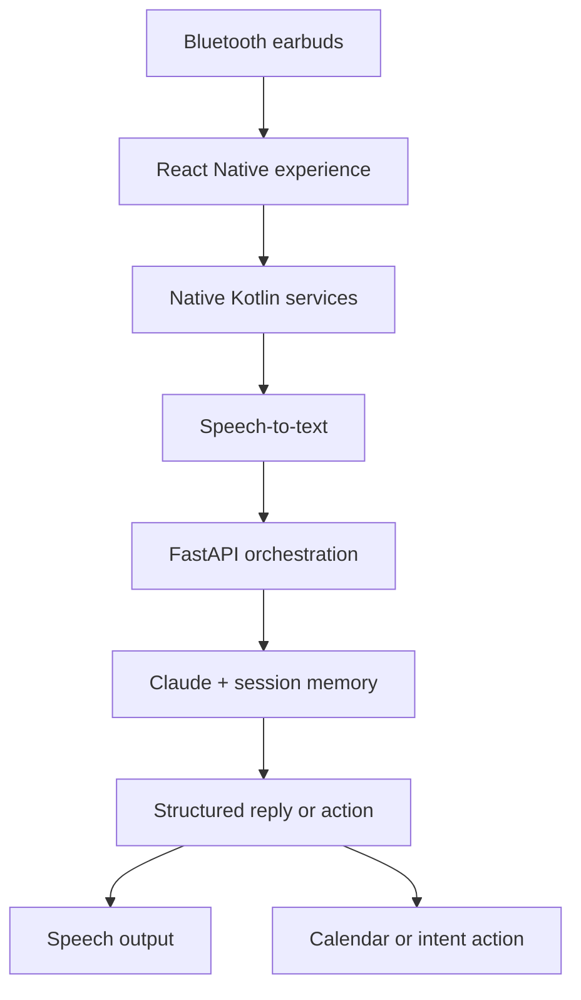

<div align="center">

# AURELIA

### An AI companion you wear—not another app you watch.

A voice-first Android agent that lives in your Bluetooth earbuds, understands natural language, speaks back, remembers the active conversation, and turns intent into safe device actions.


</div>

---

## Why Aurelia

Most assistants wait behind a screen. Aurelia is designed for moments when the screen should disappear: walking, commuting, exercising, or moving through a busy day.

Connect your earbuds, tap to speak, and Aurelia runs a complete speech-to-action loop. It can answer through text-to-speech, create calendar events, prepare messages, retain short-term context, and deliver configurable proactive check-ins—all while keeping model credentials off the device.

## What it can do

| Capability | Experience |
|---|---|
| Voice conversation | Android speech recognition → Claude → Android text-to-speech |
| Bluetooth awareness | Detects headset connection state and clears sessions on disconnect |
| Proactive check-ins | Foreground scheduling service delivers configurable spoken prompts |
| Calendar actions | Creates events through the Android Calendar Provider |
| Message preparation | Opens WhatsApp, SMS, or email with recipient and content pre-filled |
| Session memory | Maintains short-term conversational context for the active session |
| Quiet mode | Immediately suppresses proactive prompts |
| Relationship aliases | Resolves phrases such as “text my wife” using on-device mappings |

> [!IMPORTANT]
> Message actions are intentionally human-in-the-loop: Aurelia prepares the message and the user taps **Send**. Calendar creation can complete directly. Fully autonomous UI interaction is outside the MVP safety boundary.

## Architecture



The client owns device integration and the backend owns intelligence. This boundary prevents the Claude API key from shipping inside the Android application and keeps model orchestration independently replaceable.

### Repository map

```text
aurelia/
├── app/
│   ├── src/
│   │   ├── api/          # Backend client
│   │   ├── automation/   # Calendar and messaging actions
│   │   ├── bluetooth/    # Headset session state
│   │   ├── memory/       # On-device session context
│   │   ├── scheduler/    # Proactive check-ins
│   │   └── voice/        # STT, TTS, and conversation loop
│   └── android/.../nativemodules/
│       ├── BluetoothSessionModule.kt
│       ├── ForegroundSchedulerService.kt
│       ├── SpeechModule.kt
│       └── CalendarModule.kt
└── backend/
    ├── main.py           # FastAPI endpoints
    ├── llm.py            # Claude adapter
    ├── memory.py         # Server-side session cache
    └── action_schema.py  # Validated device-action contract
```

## Quick start

### Prerequisites

- Node.js 18+
- JDK 17 and Android SDK
- Python 3.11+
- An Android device or emulator
- An Anthropic API key
- Bluetooth earbuds for end-to-end hardware validation

### 1. Start the AI backend

```bash
cd backend
python -m venv .venv
```

Activate the environment:

```powershell
.venv\Scripts\Activate.ps1
```

```bash
# macOS / Linux
source .venv/bin/activate
```

Then install and run:

```bash
pip install -r requirements.txt
cp .env.example .env
# Add ANTHROPIC_API_KEY to .env
python main.py
```

The API starts at `http://localhost:8000`; interactive documentation is available at `/docs`.

### 2. Run the Android app

```bash
cd app
npm install
npx react-native start
```

In a second terminal:

```bash
cd app
npx react-native run-android
```

The emulator uses `http://10.0.2.2:8000` by default. For a physical device, set `backendBaseUrl` in `app/src/config.ts` to your computer's LAN address.

### 3. Grant device permissions

On first launch, allow microphone, notifications, Bluetooth connection, and calendar access. Relationship aliases are stored locally on the device.

## API surface

| Endpoint | Purpose |
|---|---|
| `GET /health` | Service readiness |
| `POST /reply` | Transcript-to-reply and structured-action orchestration |
| `POST /check-in-prompt` | Generate a proactive spoken prompt |
| `POST /session/clear` | Remove active server-side session context |

## Validation

Aurelia uses a deliberate hardware-first manual validation strategy. The key acceptance flow is:

1. Connect Bluetooth earbuds and confirm the active session.
2. Speak through tap-to-talk and hear the generated response.
3. Create a calendar event from natural language.
4. prepare a WhatsApp, SMS, or email message.
5. Background the app and verify a scheduled spoken check-in.
6. Enable quiet mode and confirm that outbound prompts stop.
7. Disconnect the earbuds and verify session memory is cleared.

Use [MANUAL_TEST_CHECKLIST.md](./MANUAL_TEST_CHECKLIST.md) for the full MVP pass and [PHASE_0_RESULTS.md](./PHASE_0_RESULTS.md) for background-execution and battery observations.

## Security and privacy by design

- Provider credentials remain in the backend environment.
- The microphone is activated only through explicit tap-to-talk in the MVP.
- Message delivery retains a final user confirmation.
- Structured action payloads constrain what the model can ask the device to do.
- Short-term memory is cleared when the Bluetooth session ends.
- Accessibility-driven autonomous sending is not enabled.

## Product direction

The current build focuses on a dependable voice loop and safe Tier 1 automation. Future exploration includes wake-word activation, long-term memory, context-aware check-ins, call/music interruption handling, and carefully governed hands-free workflows.

See [masterplan.md](./masterplan.md) for the complete product specification, [RESEARCH_NOTES.md](./RESEARCH_NOTES.md) for architectural references, and [PHASE_0_RESULTS.md](./PHASE_0_RESULTS.md) for the hardware gate.

---

<div align="center">

Built to make AI feel present, useful, and invisible.

</div>
